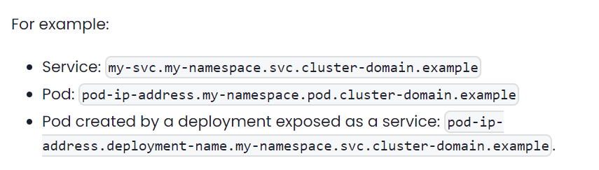
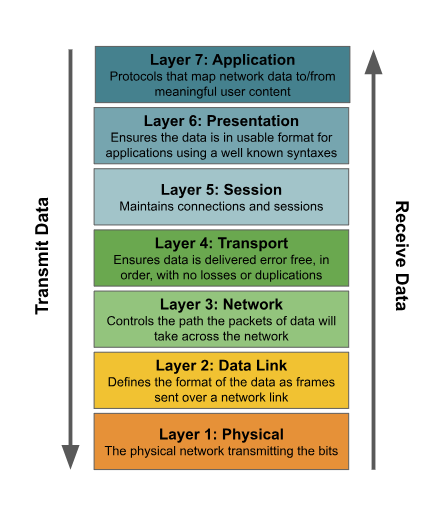
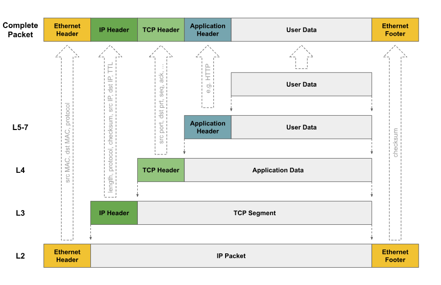

# Overview K8s Networking

- *In this guide you will learn:*

  + The fundamental network behaviors the Kubernetes network model defines.
  + How kubernetes works with a variety of different network implemetations.
  + What Kubernetes Services are.
  + How DNS works within Kubernetes.
  + What "Nat outgoing" is and when you would want to use it.
  + What "dual stack" is.

1. **The Kubernetes network model**

- *The K8s network model specifies:*

  + Every pod gets its own IP address.
  + Containers within a pod share the Pod IP address and communicate freely with each other.
  + Pods can commnunicate with all other pods in the cluster using pod Ip address.
  + Isolation (restricting what each pod can communicate with) is defined using network policies.

2. **Kubernetes network implementations**

- Kubernetes built in network support, kubenet, can provide some basic network connectivity. However, it is more common to use third party network implementations which plug into k8s using the CNI.

- There are lots of different kinds of CNI plugins, but the two main ones are:
  + network plugins, which are responsible for connecting pod to the network.
  + IPAM (IP Address Management) plugins, which are responsible for allocating pod IP addresses.

3. **Kubernetes Services**

- Within the cluster the network service is usually represented as virtual IP address, and kube-proxy load balances connections to the virtual IP accross the group of pods backing the service.

- The virtual IP is discoverable through Kubernetes DNS. The DNS name and virtual IP address remain constant for the life time of the service, even though the pods backing the service may be created or destroyed, and the number of pods backing the service may change over time.

4. **Kubernetes DNS**

- Each Kubernetes cluster provides a `DNS service`. Every Pod and every service is discoverable through the Kubernetes `DNS service`.

- The `DNS service` is implemented as Kubernetes Service that maps to one or more DNS server pods (usually coreDNS), that are scheduled just like any other pod. Pods in the cluster are configured to use the `DNS service`

- **References**: https://kubernetes.io/docs/concepts/services-networking/dns-pod-service/

5. **NAT outgoing**

- The K8s network model specifies that pods must be able to communicate with each other directly using pod IP addresses. 

- Typically for these deployments, when a pod initiates a connection to an IP address outside the cluster, the node hosting the pod  will SNAT (Source Network Address Translation) map the source address of the packet from the pod IP to the Node IP. This enables the connection to be routed accross the rest of the network to the destination.

# Networking

- `Calico` hides the complexities for you. However, if you would like to learn more about networking so you can better understand what is happening under the covers, this guide provides a short introduction to some of the key fundamental networking concepts for anyone who is not aleardy familiar with them.

## Network Layers

- The layers are typically abbreviated as L1-L7. You can think of data as passing through each of these layers in turn as it is sent or received from an application.

## Anatomy of a network packet

- When sending data over the network, each layer in the network stack adds its own header containing the control/metadata the layer needs to process the packet as it traverses the network, passing the resulting packet on the the next layer of the stack. 

## IP addressing, subnets and IP routing

- There are several ranges of IP addresses that are reserved as "private", that can only be used within local private networks, are not routable across the internet. These can be reused by enterprises as often as they want to. In contrast "public" IP addresses are globally unique across the whole of the internet. As the number of network devices and networks connected to the internet has grown, public IPv4 addresses are now in short supply.

  