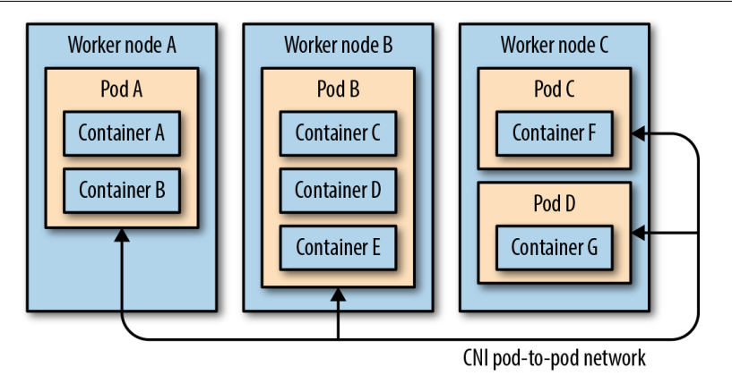

# k8s-study-lab

Some Labs from intermiadiate level to advanced level to comprehend intensively about kubernetes on test/dev development and Cloud Environment.

# Kubernetes (K8s) Overview

Kubernetes, often abbreviated as K8s, is an open-source platform designed to automate deploying, scailing, and operating containerized applications. Originally developed by Google, Kubernetes is now maintained by the Cloud Native Computing Foundation (CNCF).

## Table of Contents

- [k8s-study-lab](#k8s-study-lab)
- [Kubernetes (K8s) Overview](#kubernetes-k8s-overview)
  - [Table of Contents](#table-of-contents)
  - [Introduction to Kubernetes](#introduction-to-kubernetes)
  - [Kubernetes Architecture](#kubernetes-architecture)
    - [Master Node](#master-node)
    - [Worker Nodes](#worker-nodes)
  - [Key Kubernetes Components](#key-kubernetes-components)
    - [API Server](#api-server)
    - [etcd](#etcd)
    - [Controller Manager](#controller-manager)
    - [Scheduler](#scheduler)
    - [Kubelet](#kubelet)
    - [Kube Proxy](#kube-proxy)
    - [Container Runtime](#container-runtime)
    - [Ingress Controller](#ingress-controller)
    - [Network Policies](#network-policies)
  - [Kubernetes Networking](#kubernetes-networking)
  - [Blog Note](#blog-note)
  - [Conclusion](#conclusion)

## Introduction to Kubernetes

Kubernetes provides a platform for automating the deployment, scaling, and operations of application containers across clusters of hosts. It works with a variety of container tools, including Docker. Kubernetes is designed to manage the complexity of distributed systems, providing mechanisms for deploying, maintaining, and scaling applications.

## Kubernetes Architecture

Kubernetes architecture is typically composed of a Master Node and multiple Worker Nodes.

### Master Node

The Master Node is responsible for managing the Kubernetes cluster, coordinating activities such as scheduling, scaling, and updating applications. Key components of the Master Node include:

- **API Server**: The front-end for the Kubernetes control plane. It handles external and internal requests to the cluster and acts as the gateway for all interactions with the cluster.
  
- **etcd**: A distributed key-value store used to store all the data about the cluster, including configurations and state information.
  
- **Controller Manager**: Manages the various controllers that regulate the state of the cluster, such as the Replication Controller and the Node Controller

- **Scheduler**: Assigns work to specific Worker Nodes based on resource availability and requirements.

### Worker Nodes

Worker Nodes are the machines where containers are actually run. Each Worker Node runs the following components:

- **Kubelet**: An agent that runs on each Worker Node, ensuring containers are running in a Pod. It communicates with the API Server and manages the lifecycle of containers on its node.

- **Kube Proxy**: A network proxy that maintains network rules on nodes. It facilitates networking services inside the Kubernetes cluster.

- **Container Runtime**: The software responsible for running containers. Docker is one of the most common container runtimes, but Kubernetes also supports others like containerd and CRI-O.

## Key Kubernetes Components

### API Server

The API Server serves as the gateway to the Kubernetes control plane, processing RESTful requests from both internal and external clients and validating and storing the cluster's state.

### etcd

etcd is a consistent and highly-available key-value store that Kubernetes uses to store all cluster data. This includes information about running workloads, configurations, and policies.

### Controller Manager

The Controller Manager runs the various controllers that monitor the state of the cluster and make changes to ensure that the desired state matches the actual state. Examples include the Replication Controller, Node Controller, and Endpoint Controller.

### Scheduler

The Scheduler watches for new Pods that have no assigned node and assigns them to a node based on resource availability, policies, and constraints.

### Kubelet

Kubelet is an agent that runs on every Worker Node. It ensures that containers are running in Pods and communicates with the Master Node's API Server.

### Kube Proxy

Kube Proxy maintains network rules on each node, allowing network communication to your Pods from network sessions inside or outside of your cluster.

### Container Runtime

The Container Runtime is responsible for running containers. Kubernetes is compatible with several container runtimes, including Docker, containerd, and CRI-O.

### Ingress Controller

1. Ingress Controller là thành phần chịu trách nhiệm xử lý các tài nguyên Ingress. Mỗi cụm Kubernetes cần có một Ingress Controller

2. Ingress Resource: Là tài nguyên của Kubernetes chứa các quy tắc định tuyến cho HTTP/HTTPS. Ingress Resource xác định cách thức điều hướng lưu lượng từ bên ngoài vào các dịch vụ nội bộ.

3. Ingress Class: Được sử dụng để xác định loại Ingress Controller sẽ xử lý tài nguyên Ingress cụ thể. Bạn có thể chỉ định class nếu sử dụng nhiều loại Ingress Controller trong cùng một cụm.

### Network Policies

Network Policies define how groups of Pods are allowed to communicate with each other and with other network endpoints. They are implemented using a CNI (Container Network Interface) plugin, such as Calico, to enforce rules governing the allowed communication paths.

## Kubernetes Networking

Kubernetes uses a flat networking model, meaning that all Pods can communicate with each other by default. Network Policies can be applied to restrict communication based on various criteria. Networking is a critical aspect of Kubernetes, enabling communication between the various components and the services they support.

## Blog Note

## Conclusion

Kubernetes is a powerful platform for managing containerized applications at scale. Understanding its components and architecture is crucial for effectively deploying and managing your workloads. Whether you're working with a small or large-scale system, Kubernetes provides the tools necessary to ensure your applications are resilient, scalable, and easily managed.

- Cấu trúc của bài slide

  1. Khái niệm k8s

  2. k8s architecture

  3. k8s key components (Main)

  4. POC 

- Annotations trong Kubernetes là một cơ chế để gán các thông tin bổ sung (metadata) vào các đối tượng như `Pod,Service,Deployment,ConfigMap` và nhiêu tài nguyên khác. Không giống như labels, không dùng để phân loại hay chọn lọc tài nguyên, `annotations` chứa các thông tin mà bạn có thể muốn liên kết với các đối tượng Kubernetes, nhưng kh được sử dụng cho mục đích lập lịch hay lọc.

*Authentication*

- Just as with many well-designed REST-based APIs, there are multiple strategies that K8s can employ for authenticating users. We can think about each of these strategies as belonging to one of three major groups:

  + Basic Authentication: Since the API Server does currently monitor this file for changes, whenever a user is added, removed,or updated, the API Server needs to be restared in order for these changes to take effect

  + X.509 client Certificates
  
  + Bearer Tokens

- Trong Kubernetes, context(ngữ cảnh) là một tập hợp các thông tin dùng để xác định cấu hình làm việc hiện tại của `kubectl`.Một context bao gồm ba thành phần chính:

  1. **Cluster**: Thông tin về cụm Kuberentes mà bạn muốn kết nối.

  2. **User**: Thông tin về người dùng hoặc certificate xác thực mà kubectl xác thực mà `kubectl` sử dụng để kết nối tới cụm.

  3. **Namespace**: Không gian làm việc mặc định mà các lệnh `kubectl` sẽ tác động vào

  

## KubeProxy

- `Kube-proxy` ban đầu được triển khai với một proxy ở không gian người dùng (userspace). `kube-proxy` đơn giản là thao tác các quy tắc `iptables` trên mỗi node. Các quy tắc này chuyển hướng lưu lượng được gửi tới một `Service IP` đến bất kỳ một trong các địa chỉ IP điểm cuối (end-point) hỗ trợ phía sau.

- Theo cách này, mỗi Pod trên mỗi node có thể giao tiếp với các Service được định nghĩa thông qua việc daemon `kube-proxy` thao tác các quy tắc iptables.

- `kube-proxy` không chịu trách nhiệm cấp phát địa chỉ IP hay đảm bào rằng các Pod có thể giao tiếp với nhau, mà chỉ giúp định tuyến traffic đến đúng dựa trên quy tắc.

## CNI (Container Network Interface)

- CNI lại tập trung vào việc cung cấp mạng cho các Pod và quản lý IP. CNI có nhiệm vụ đảm bảo rằng mọi Pod trong cụm K8s đều có địa chỉ IP riêng và có thể giao tiếp với nhau qua mạng.

- Các nhiệm vụ chính của CNI bao gồm:

    + Cấp phát địa chỉ Ip cho Pod khi nó được tạo ra.

    + Thiết lập kết nối mạng giữa các Pod trên các Node khác nhau trong cụm.

    + Quản lý route mạng và đảm bảo rằng mỗi Pod có thể giao tiếp với các Pod khác trên bất kỳ Node nào.

    + Tùy thuộc vào plugin CNI, nó có thể cung cấp thêm các tính năng bảo mật như `network policies`
 để kiếm soát traffic giữa các Pod.

- Khi một Pod mới được tạo trong k8s, Calico chịu trách nhiệm cấp phát địa chỉ Ip cho Pod thông qua các quy trình sau:

    + IPAM (IP address Management )

        `Calico IPAM` quản lý không gian địa chỉ và phân bổ IP cho các Pod. Mỗi Pod sẽ được gán một địa chỉ duy nhất, địa chỉ này sẽ tồn tại cho đến khi các Pod bị xóa.

- Khi 2 Pod trên cùng một node cần giao tiếp với nhau, Calico chỉ cần sử dụng cơ chế `local routing`:
    + Calico thiết lập các route nội bộ trên Node để đảm bảo các Pod có thể giao tiếp trực tiếp với nhau mà kh cần rời khỏi Node.

    + Các địa chỉ Ip của Pod được duy trì cục bộ và kh cần router ra bên ngoài.

  

## KubeApiServer
- Khi bạn gửi lệnh `kubectl apply`, `kube-apiserver` là thành phần đầu tiên tiếp nhận yêu cầu này. Dưới đây là các bước mà `kube-apiserver` thực hiện:

    1. Nhận yêu cầu: `Kube-apiserver` nhận yêu cầu từ `kubectl` để tạo Pod mới với tên `my-pod`.

    2. Xác thực và phân quyền: `Kube-apiserver` kiểm tra xem người dùng có quyền tạo Pod này không thông qua cơ chế RBAC

    3. Cập nhật vào etcd: Sau khi xác thực, `kube-apiserver` ghi thông tin vào Pod `my-pod` vào etcd, nơi lưu trữ trạng thái của cụm K8s.
-> Lúc này pod được ghi nhận trong hệ thống, nhưn g chưa được triển khai trên Node nào.

- Sau khi trạng thái của Pod `my-pod` được lưu vào etcd, kube-controller-manager sẽ theo dõi để đảm bảo rằng Pod này được triển khai theo đúng yêu cầu. Các bước mà `kube-controller-manager`

    1. Phát hiện sự kiện: `Kube-controller-manager` nhận biết rằng một Pod mới cần được tạo ra dựa trên trạng thái đã được lưu trong `etcd`.

    2. Kiểm tra số lượng bản sao: `Controller` kiểm tra xem số lượng Pod được yêu cầu có khớp với số lượng Pod hiện tại không. Nếu Pod chưa tồn tại trên node nào, nó sẽ điều phối để tạo Pod.

    3. Tạo Pod trên Node: `Kube-controller-manager` phối hợp với `kube-scheduler` để chọn Node phù hợp trong cụm, nơi Pod sẽ được triển khai.

## Kubelet

- Kubelet giám sát trạng thái của containers bằng cách sử dụng các probe được định nghĩa trong `PodSpec`:
    + `Liveness probe`: Kiểm tra xem container còn sống hay không. Nếu container chưa phản hồi theo liveness probe, Kubelet sẽ khởi động lại contaienr.
    + `Readines probe`: Kiểm tra xem container đã sắn sàng phục vụ lưu lượng hay chưa. Nếu chưa sẵn sàng, container sẽ bị loại khỏi danh sách các endpoint của dịch vụ.

- Kubelet liên tục gửi các báo cáo về trạng thái của Pod và Container về `Kube-apiServer`.Những thông tin này bao gồm:
    + Trạng thái hiện tại của Pod.
    + Tài nguyên sử dụng của node như CPU,RAM.
    + Trạng thái sức khỏe của container.

## Kube-scheduler

  - Tóm tắt các bước hoạt động của `kube-scheduler`:

    + Nhận Pod chưa được gán vào Node: `kube-scheduler` nhận thông tin về các Pod chưa được gán vào Node từ kube-apiserver.

    + Thu thập thông tin: `kube-scheduler` thu nhập thông tin về các Node và yêu cầu của Pod.

    + Filter: Loại bỏ các Node không đáp ứng yêu cầu của Pod (CPU, RAM, taints, affinity,...).

    + Score: Đánh giá các Node dựa trên các tiêu chí khác nhau như (tài nguyên,...)

    + Chọn Node và gán Pod vào Node.

  

    